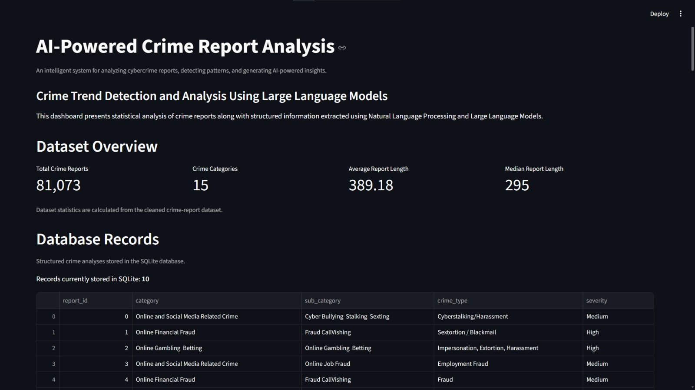
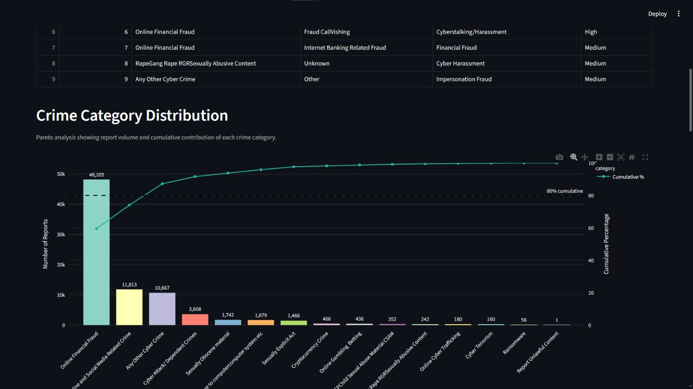
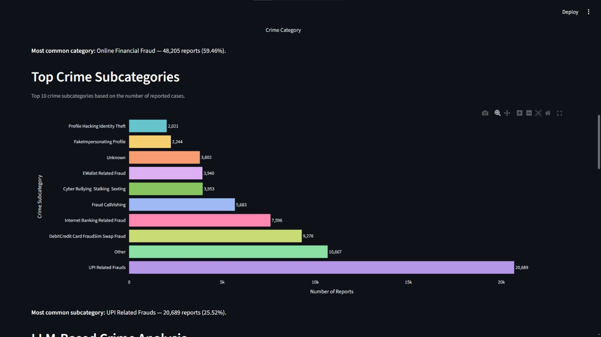
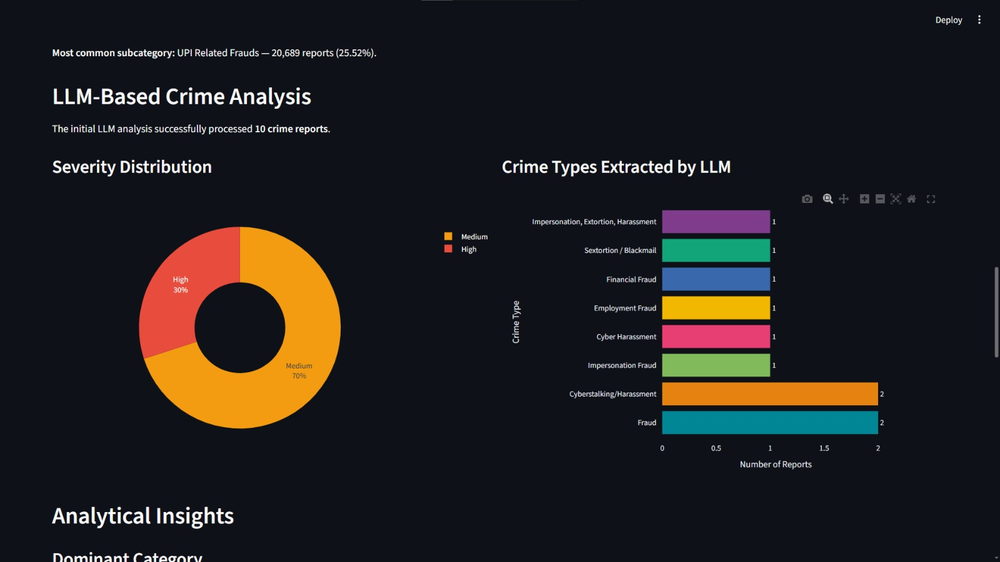
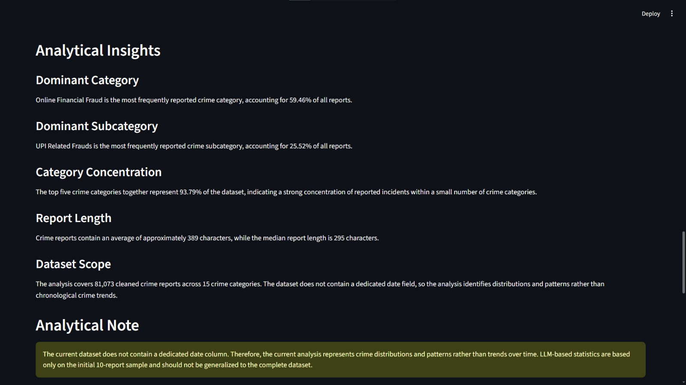
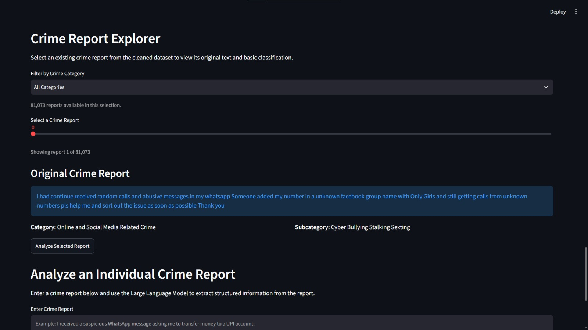
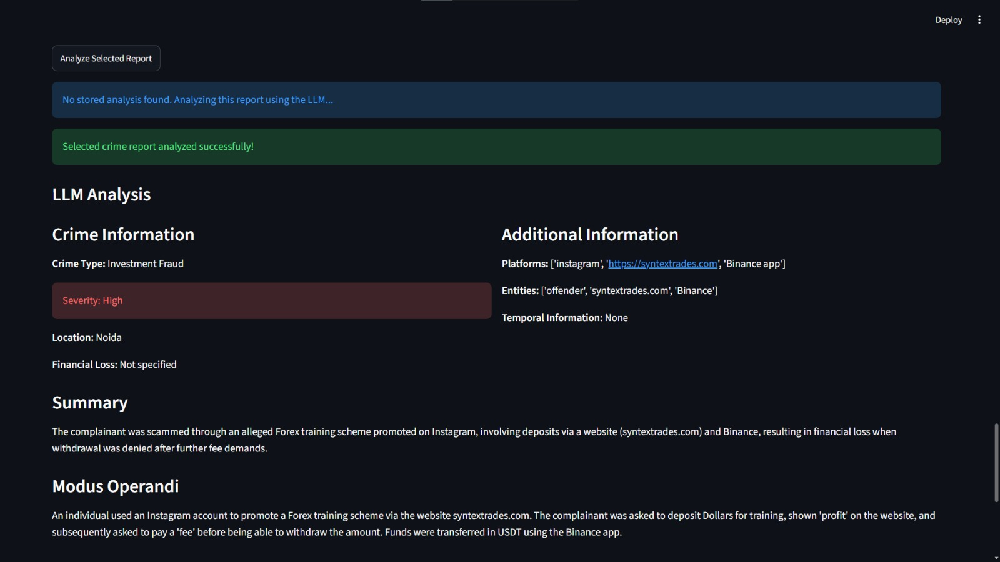

# AI-Powered Crime Report Analysis and Trend Detection System Using Large Language Models

## Overview

The AI-Powered Crime Report Analysis and Trend Detection System Using Large Language Models is an academic MCA mini-project developed to demonstrate the use of Natural Language Processing (NLP), Large Language Models (LLMs), data analysis, and visualization for analyzing cybercrime reports.

Crime reports often contain valuable information in the form of unstructured textual descriptions. Manually examining a large collection of such reports can be time-consuming and makes it difficult to identify recurring patterns and important characteristics.

The proposed system processes crime-report data through data preprocessing, exploratory data analysis, NLP-based text processing, LLM-based analysis, structured data generation, pattern analysis, database storage, and interactive visualization.

Statistical analysis is performed on **81,073 cleaned crime reports**. The current LLM-based structured analysis and comparison components use a **10-report sample** because of API usage limitations in the development environment.

## Objectives

- To preprocess and clean crime-report data.
- To perform exploratory data analysis on crime categories and subcategories.
- To apply NLP techniques for basic crime-related keyword detection.
- To use a Large Language Model to extract structured information from crime reports.
- To generate AI-based observations from analyzed crime reports.
- To identify important patterns and distributions in the crime dataset.
- To store structured crime analysis results in a SQLite database.
- To develop an interactive dashboard for exploring analytical results.
- To demonstrate the practical integration of NLP, LLMs, data analysis, and visualization.

## Key Features

### Data Preprocessing

- Handles missing values.
- Removes duplicate records.
- Cleans and prepares the crime-report dataset.
- Produces a cleaned dataset for analysis.

### Exploratory Data Analysis

The system analyzes:

- Crime category distribution.
- Crime subcategory distribution.
- Crime report length statistics.
- Frequently occurring crime categories and subcategories.

### NLP-Based Keyword Detection

Basic NLP processing is applied to crime-report text to detect predefined crime-related keywords belonging to groups such as:

- Financial crime.
- Social media.
- Cyber attacks.
- Harassment.
- Job fraud.

### LLM-Based Crime Analysis

Google Gemini is used to analyze individual crime reports and extract structured information including:

- Crime type.
- Summary.
- Modus operandi.
- Platforms.
- Entities.
- Location.
- Temporal information.
- Financial loss.
- Severity.

### AI-Based Observations

The system generates structured AI observations from LLM-analyzed crime reports to provide additional interpretation of the extracted information.

### Pattern and Insight Analysis

The system identifies important patterns from the cleaned dataset, including:

- Dominant crime categories.
- Dominant crime subcategories.
- Category concentration.
- Report length characteristics.
- Dataset scope and limitations.

### SQLite Database

LLM-based structured crime records are stored in a SQLite database for retrieval and display within the application.

### Interactive Streamlit Dashboard

The dashboard provides:

- Dataset statistics.
- Crime category visualization.
- Crime subcategory visualization.
- LLM severity distribution.
- LLM-extracted crime types.
- Analytical insights.
- Crime report exploration.
- Individual crime report analysis.
- NLP keyword detection.

## System Workflow

```text
Dataset Collection
        ↓
Data Preprocessing
        ↓
Exploratory Data Analysis
        ↓
NLP Processing
        ↓
LLM-Based Crime Analysis
        ↓
Structured Crime Records
        ↓
AI Observations
        ↓
Pattern and Insight Analysis
        ↓
Database Storage
        ↓
Interactive Dashboard
Technologies Used
Programming Language: Python
Data Processing: Pandas, NumPy
NLP: Python Regular Expressions and predefined keyword detection
Large Language Model: Google Gemini 2.5 Flash
LLM SDK: Google GenAI
Visualization: Plotly, Matplotlib
Dashboard: Streamlit
Database: SQLite
Development Environment: Visual Studio Code
Environment Management: Python Virtual Environment
Dataset

The project uses the Crime Reports Dataset available on Hugging Face.

Dataset source:

Dev523/Crime-Reports-Dataset

The dataset contains crime-report information with the following fields:

category
sub_category
crimeaditionalinfo

The original working dataset contained 93,686 records.

After preprocessing, the final cleaned dataset contains:

81,073 crime reports

The dataset does not contain a dedicated native date or location column. Therefore, the implemented statistical analysis focuses on crime distributions and patterns rather than chronological crime trends.

Project Structure
AI_Crime_Report_Analysis/
│
├── dashboard/
│   └── app.py
│
├── data/
│   ├── raw/
│   ├── processed/
│   └── crime_reports.db
│
├── notebooks/
│
├── outputs/
│   └── charts/
│
├── src/
│   ├── ai_observations.py
│   ├── batch_llm_pipeline.py
│   ├── cleaned_data_inspection.py
│   ├── data_inspection.py
│   ├── database.py
│   ├── eda.py
│   ├── insight_generation.py
│   ├── insight_report.py
│   ├── llm_comparison_analysis.py
│   ├── llm_pipeline.py
│   ├── llm_test.py
│   ├── llm_trend_analysis.py
│   ├── nlp_analysis.py
│   ├── pattern_analysis.py
│   ├── preprocessing.py
│   ├── prompt_testing.py
│   ├── prompts.py
│   ├── single_report_analyzer.py
│   ├── trend_analysis.py
│   └── trend_visualization.py
│
├── tests/
│
├── utils/
│
├── .env
├── .gitignore
├── README.md
└── requirements.txt
Results

The cleaned dataset contains 81,073 reports distributed across 15 crime categories.

The major observed categories include:

Online Financial Fraud.
Online and Social Media Related Crime.
Any Other Cyber Crime.
Cyber Attack / Dependent Crimes.

The most frequent crime category is Online Financial Fraud, representing approximately 59.46% of the cleaned dataset.

The most frequent subcategory is UPI Related Frauds, representing approximately 25.52% of the cleaned dataset.

The top five crime categories account for approximately 93.79% of the cleaned records.

Report length analysis produced:

Average report length: 389.18
Median report length: 295
Maximum report length: 1,499
LLM Analysis Scope

The LLM components were developed and tested using a 10-report sample because of API usage limitations during development.

The LLM analysis demonstrates structured information extraction from individual crime narratives. The LLM-generated crime types are compared with the original dataset categories to demonstrate the difference between predefined dataset classification and semantic interpretation of crime narratives.

The 10-report comparison is a development sample and should not be treated as a statistical representation of the complete dataset.

Installation

Clone the repository and navigate to the project directory.

Create a Python virtual environment:

python -m venv venv

Activate the environment on Windows PowerShell:

.\venv\Scripts\Activate.ps1

Install the required dependencies:

pip install -r requirements.txt
API Key Configuration

The project uses the Google Gemini API for LLM-based crime report analysis.

Create a .env file in the project root:

GEMINI_API_KEY=your_api_key_here

The actual API key must not be committed to GitHub.

Running the Dashboard

From the project root:

streamlit run dashboard/app.py

The Streamlit dashboard provides access to the project's statistical analysis, visualizations, stored LLM results, crime report explorer, and individual crime report analyzer.

Running Individual Components

The main processing components can be executed from the project root.

Example:

python src/preprocessing.py
python src/eda.py
python src/nlp_analysis.py
python src/pattern_analysis.py
python src/insight_generation.py

The LLM pipeline and analysis scripts require a valid GEMINI_API_KEY.

Limitations
The dataset does not contain a dedicated native date column, so chronological trend analysis is not implemented.
The dataset does not contain a dedicated native location column.
LLM-based batch processing is limited to a small development sample because of API usage restrictions.
The current dashboard works with the prepared project dataset rather than providing a general-purpose dataset upload feature.
NLP keyword detection uses a predefined keyword dictionary and does not represent a complete NLP classification system.
LLM-generated results depend on the quality and context of the input crime report.
Future Enhancements

Possible future enhancements include:

Integration of larger-scale LLM processing when suitable API capacity is available.
Improved NLP-based crime classification.
Automatic extraction and normalization of dates and locations from report narratives.
Chronological trend analysis when reliable temporal information is available.
Geographical visualization of extracted locations.
Support for additional crime datasets.
Advanced statistical and machine learning models for crime prediction.
Improved entity extraction and relationship analysis.
Authentication and role-based access for dashboard users.
Deployment of the system as a production web application.
Academic Project

This project was developed as part of the Master of Computer Applications (MCA) Mini Project.

The project demonstrates the integration of:

Artificial Intelligence + Natural Language Processing + Large Language Models + Data Analysis + Data Visualization

Disclaimer

This project is developed for academic and demonstration purposes. The generated LLM-based analysis should be treated as analytical assistance and not as an authoritative legal, investigative, or law-enforcement conclusion.
## Dashboard Screenshots

### Dashboard Overview


### Crime Category Distribution


### Crime Subcategory Distribution


### LLM Severity Distribution


### LLM Crime Types


### Analytical Insights


### Crime Report Analysis


### Working Crime Analysis
